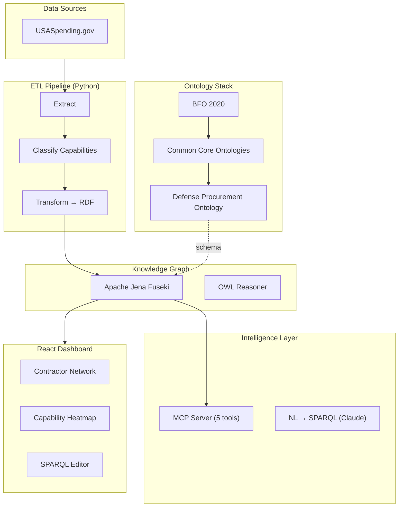

# DefPrO — Defense Procurement Ontology Intelligence Platform

An ontology-driven knowledge graph over public federal procurement data that enables intelligence queries no flat database can answer — contractor capability mapping, teaming pattern analysis, industrial base gap detection, and acquisition target identification.

Built on **BFO 2020** (ISO 21838) and **Common Core Ontologies**, DefPrO transforms raw USASpending.gov contract data into a queryable knowledge graph with OWL reasoning, SPARQL intelligence queries, and a natural language interface powered by Claude.

```
USASpending.gov ──► ETL Pipeline ──► Apache Jena Fuseki ──► MCP Server / Dashboard
                    (Python)         (SPARQL + OWL)         (TypeScript / React)
```

## Why it exists

Commercial procurement tools offer keyword search over flat award records. They don't model how contractors, capabilities, agencies and awards relate, so questions like "which small businesses already team with primes on hypersonics work?" take manual analysis. DefPrO stores those relationships in a knowledge graph, so one SPARQL query, or one plain-English question through the MCP server, can answer them. It uses only public USASpending.gov data.

## Architecture



## Quick Start

### Prerequisites

- Python 3.11+
- Docker & Docker Compose
- Node.js 18+
- An Anthropic API key (for capability classification and NL queries)

### 1. Clone and configure

```bash
git clone https://github.com/dkmiller321/DefPrO.git
cd DefPrO
cp .env.example .env
# Edit .env and add your ANTHROPIC_API_KEY
```

### 2. Run automated setup

```bash
bash scripts/setup.sh
```

This will:
1. Install Python dependencies
2. Generate sample data (500 awards, 20 contractors, 7,876 triples)
3. Start Fuseki via Docker
4. Load ontology and sample data into the triple store
5. Install dashboard dependencies

### 3. Start the dashboard

```bash
cd dashboard && npm run dev
```

### 4. Or bring up the full stack with Docker Compose

```bash
docker compose up -d
```

| Service    | URL                    |
|------------|------------------------|
| Dashboard  | http://localhost:5173   |
| Fuseki UI  | http://localhost:3030   |
| MCP Server | http://localhost:8080   |

## Project Structure

```
DefPrO/
├── ontology/                        # OWL/Turtle ontology files
│   ├── defense-procurement.ttl      # Core domain ontology (BFO/CCO-based)
│   ├── capability-taxonomy.ttl      # Subcapability hierarchy
│   └── naics-psc-mapping.ttl        # NAICS/PSC reference individuals
├── etl/                             # Python ETL pipeline
│   ├── usaspending_client.py        # USASpending.gov API client
│   ├── capability_classifier.py     # Two-layer capability classifier
│   ├── rdf_transformer.py           # JSON → RDF triple transformer
│   ├── pipeline.py                  # Pipeline orchestrator + CLI
│   ├── validators.py                # Data quality validation
│   └── config.py                    # Central configuration
├── triplestore/                     # Fuseki configuration
│   ├── docker-compose.yml           # Fuseki container
│   ├── fuseki-config.ttl            # TDB2 + OWL reasoning config
│   ├── load_data.sh                 # Bulk data loader
│   └── queries/                     # 7 pre-built SPARQL queries
├── mcp-server/                      # MCP intelligence server
│   └── src/
│       ├── index.ts                 # Server entry point (5 tools)
│       ├── sparql/                  # SPARQL client, query builder, NL→SPARQL
│       └── tools/                   # Tool implementations
├── dashboard/                       # React/TypeScript dashboard
│   └── src/
│       ├── App.tsx                  # 5-page app (Overview, Contractors, etc.)
│       ├── api/sparql.ts            # SPARQL query layer
│       ├── components/graphs/       # D3 network graph, heatmap, charts
│       ├── components/tables/       # Data tables
│       └── components/search/       # SPARQL editor with CSV export
├── tests/                           # 138 tests across 4 suites
├── scripts/                         # Setup and utility scripts
├── docs/                            # Documentation
│   ├── ontology-decisions.md        # Design rationale
│   ├── query-catalog.md             # SPARQL query documentation
│   └── api-reference.md             # MCP server tool reference
├── docker-compose.yml               # Full stack deployment
└── output/                          # Generated data (sample_data.ttl)
```

## Ontology

The domain ontology models defense procurement as a network of relationships between contractors, agencies, contracts, and capabilities:

```
BFO:IndependentContinuant
├── dp:Contractor           (with UEI, CAGE, small business status)
│   ├── dp:PrimeContractor
│   └── dp:Subcontractor
├── dp:GovernmentAgency
└── dp:PlaceOfPerformance

BFO:RealizableEntity
└── dp:TechnicalCapability
    ├── dp:ElectronicWarfare
    ├── dp:C4ISR
    ├── dp:AutonomousSystems
    ├── dp:CyberSecurity
    ├── dp:AIandML
    ├── dp:SpaceSystems
    └── ... (13 capability classes)

BFO:Process
└── dp:ContractAward        (amount, dates, competition type, set-aside)
```

Key relationships: `awardedTo`, `awardedBy`, `hasCapability`, `requiresCapability`, `teamsWithOn`, `hasSubcontractor`.

See [docs/ontology-decisions.md](docs/ontology-decisions.md) for design rationale.

## ETL Pipeline

The pipeline extracts contract data from USASpending.gov, classifies capabilities, and transforms everything into RDF triples.

### Two-Layer Capability Classifier

1. **Deterministic layer** — Maps PSC codes, NAICS codes, and keyword patterns to capabilities (fast, no API calls)
2. **LLM fallback** — Sends ambiguous contract descriptions to Claude for zero-shot classification against the ontology taxonomy

### Running the pipeline

```bash
# Dry run (no Fuseki upload)
python -m etl.pipeline \
  --agency "Defense Advanced Research Projects Agency" \
  --fiscal-year 2024 \
  --dry-run

# Full run with Fuseki upload
python -m etl.pipeline \
  --agency "Department of the Navy" \
  --fiscal-year 2024

# Generate sample data only
python scripts/seed_sample_data.py
```

## SPARQL Queries

Seven pre-built intelligence queries in `triplestore/queries/`:

| Query | Business Question |
|-------|-------------------|
| `capability_gap.sparql` | Which capabilities have growing spend but a shrinking contractor base? |
| `teaming_patterns.sparql` | Which contractors sub for 3+ different primes on the same capability? |
| `contractor_diversification.sparql` | Who is expanding into new capability areas? |
| `spend_concentration.sparql` | What percentage of spend per capability goes to a single contractor? |
| `sbir_pipeline.sparql` | Which SBIR awardees have crossed into production contracts? |
| `emerging_contractors.sparql` | Which small businesses are growing fastest? |
| `supply_chain_risk.sparql` | Where are single-source dependencies in the supply chain? |

See [docs/query-catalog.md](docs/query-catalog.md) for full query documentation with sample output.

## MCP Server

The MCP server exposes 5 tools for procurement intelligence:

| Tool | Description |
|------|-------------|
| `query_contractors` | Find contractors by capability, size, agency, fiscal year |
| `analyze_teaming` | Discover teaming patterns between contractors |
| `capability_gap_analysis` | Identify capability gaps with growing demand |
| `contractor_profile` | Deep profile of a specific contractor |
| `natural_language_query` | Convert natural language to SPARQL via Claude |

See [docs/api-reference.md](docs/api-reference.md) for schemas and examples.

## Dashboard

React/TypeScript dashboard with five pages:

- **Overview** — KPI cards, spend trend line, spend-by-capability bar chart
- **Contractors** — Searchable/sortable contractor table with award counts and capabilities
- **Capabilities** — Heatmap of capability concentration across agencies
- **Teaming** — D3.js force-directed network graph of contractor relationships
- **Query** — SPARQL editor with example queries, results table, and CSV export

Built with Vite, Tailwind CSS, Recharts, D3.js, and Lucide icons.

## Tests

```bash
# Run all 138 tests (all passing)
python -m pytest tests/ -v

# Run individual suites
python -m pytest tests/test_ontology_consistency.py -v   # 50 tests
python -m pytest tests/test_etl.py -v                    # 15 tests
python -m pytest tests/test_classifier.py -v             # 33 tests
python -m pytest tests/test_transformer.py -v            # 40 tests
```

## Tech Stack

| Layer | Technology |
|-------|------------|
| Ontology | OWL 2 / Turtle, BFO 2020, Common Core Ontologies |
| Triple Store | Apache Jena Fuseki (TDB2 + OWL reasoning) |
| ETL | Python 3.11+, rdflib, requests, pandas |
| Classifier | Deterministic rules + Claude API fallback |
| MCP Server | TypeScript, @modelcontextprotocol/sdk |
| Dashboard | React 18, TypeScript, Vite, Tailwind, D3.js, Recharts |
| Deployment | Docker Compose (Fuseki + MCP Server + Dashboard) |

## License

[MIT](LICENSE) © 2026 Donald Miller
